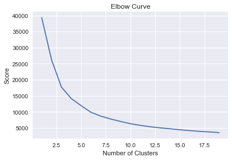

# Consumer Segmentation
Consumer segmentation is the practice of dividing a customer base into groups. In each of these groups the individuals are similar to each other in some ways. This practice allows a business to create a group specific campaign or digital advertisement. This not only increases the effectiveness of the business's marketing efforts, it helps in reducing the marketing costs by reducing spends on certain audience groups that might react differently to a campaign. Segmentation also enables businesses to focus marketing activities more on certain platforms based on the characteristics of the segments.
Though segmentation is used to create homogenous groups of individuals, we will use it to understand consumer behaviour in this notebook.


In this script, we look at one of the most popular  segmentation algorithms; the k-means clustering algorithm.  k-means clustering is an *unsupervised learning* algorithm that groups data into $K$ number of sets by using an iterative process. For each cluster, the centroid is chosen in such a way that the distance between the centroid and the data points in the cluster is minimized. Before we carry on, we drop variables that are nominal in nature. We also try to convert the review text to sentiment scores as K Means only works with numerical data.

# Library Load

Here we will be using the pandas library to do data processing. The sklearn modules also help with necessary scaling of variables.


```python
import pandas as pd
import numpy as np
from sklearn.cluster import KMeans
from sklearn.preprocessing import LabelEncoder
from sklearn.preprocessing import StandardScaler
from sklearn.preprocessing import MinMaxScaler
from sklearn.mixture import GaussianMixture #For GMM clustering
import seaborn as sns
import matplotlib.pyplot as plt

%matplotlib inline

```


```python
review_data = pd.read_csv('Womens Clothing E-Commerce Reviews.csv')
review_data.dropna(inplace=True)
#review_data=review_data.drop(['Unnamed: 0', 'Clothing ID'],axis=1)
print(review_data.dtypes)
review_data.head(5)
```

    Unnamed: 0                  int64
    Clothing ID                 int64
    Age                         int64
    Title                      object
    Review Text                object
    Rating                      int64
    Recommended IND             int64
    Positive Feedback Count     int64
    Division Name              object
    Department Name            object
    Class Name                 object
    dtype: object


<div>
<style>
    .dataframe thead tr:only-child th {
        text-align: right;
    }

    .dataframe thead th {
        text-align: left;
    }

    .dataframe tbody tr th {
        vertical-align: top;
    }
</style>
<table border="1" class="dataframe">
  <thead>
    <tr style="text-align: right;">
      <th></th>
      <th>Unnamed: 0</th>
      <th>Clothing ID</th>
      <th>Age</th>
      <th>Title</th>
      <th>Review Text</th>
      <th>Rating</th>
      <th>Recommended IND</th>
      <th>Positive Feedback Count</th>
      <th>Division Name</th>
      <th>Department Name</th>
      <th>Class Name</th>
    </tr>
  </thead>
  <tbody>
    <tr>
      <th>2</th>
      <td>2</td>
      <td>1077</td>
      <td>60</td>
      <td>Some major design flaws</td>
      <td>I had such high hopes for this dress and reall...</td>
      <td>3</td>
      <td>0</td>
      <td>0</td>
      <td>General</td>
      <td>Dresses</td>
      <td>Dresses</td>
    </tr>
    <tr>
      <th>3</th>
      <td>3</td>
      <td>1049</td>
      <td>50</td>
      <td>My favorite buy!</td>
      <td>I love, love, love this jumpsuit. it's fun, fl...</td>
      <td>5</td>
      <td>1</td>
      <td>0</td>
      <td>General Petite</td>
      <td>Bottoms</td>
      <td>Pants</td>
    </tr>
    <tr>
      <th>4</th>
      <td>4</td>
      <td>847</td>
      <td>47</td>
      <td>Flattering shirt</td>
      <td>This shirt is very flattering to all due to th...</td>
      <td>5</td>
      <td>1</td>
      <td>6</td>
      <td>General</td>
      <td>Tops</td>
      <td>Blouses</td>
    </tr>
    <tr>
      <th>5</th>
      <td>5</td>
      <td>1080</td>
      <td>49</td>
      <td>Not for the very petite</td>
      <td>I love tracy reese dresses, but this one is no...</td>
      <td>2</td>
      <td>0</td>
      <td>4</td>
      <td>General</td>
      <td>Dresses</td>
      <td>Dresses</td>
    </tr>
    <tr>
      <th>6</th>
      <td>6</td>
      <td>858</td>
      <td>39</td>
      <td>Cagrcoal shimmer fun</td>
      <td>I aded this in my basket at hte last mintue to...</td>
      <td>5</td>
      <td>1</td>
      <td>1</td>
      <td>General Petite</td>
      <td>Tops</td>
      <td>Knits</td>
    </tr>
  </tbody>
</table>
</div>


* In the next portion of the notebook we remove all the categorical variables.


```python
# remove all the columns that are categorical variables
review_data_k_means=review_data.drop(['Unnamed: 0', 'Clothing ID','Class Name','Department Name','Title','Division Name','Recommended IND'],axis=1)
```
# converting review text to sentiment score
from afinn import Afinn
afinn= Afinn()
review_data_k_means['Review Text'] = review_data_k_means['Review Text'].str.lower()
review_data_k_means['sent_score'] = review_data_k_means.apply(lambda row: afinn.score(row['Review Text']), axis=1)

sent_score = review_data_k_means['sent_score'].values
with open("sent.txt", "wb") as fp:   #Pickling
    pickle.dump(sent_score, fp)

with open("sent.txt", "rb") as fp:   # Unpickling
    b = pickle.load(fp)

#print(b)


## adding the minimum value of sentiment score so as to remove negative sentiment scores


Each product has a text review associated with it. Text can be converted to a numerical value using sentiment scores. One way to do this is to use predefined sentiment lexicons and match them accordingly. For this example, we will use the AFINN lexicon.

As the Afinn library is not available on Kaggle, I have tried to post this portion of the code in raw format. A negative value denotes negative sentiment and a positive score indicates positive sentiments. The scores that are returned are then stored in a `.txt` format and called using the `pickle.load` function as seen below.


```python
## adding the minimum value of sentiment score so as to remove negative sentiment scores


import pickle

with open("sent.txt", "rb") as fp:   # Unpickling
    b = pickle.load(fp)

b

review_data_k_means['sent_score'] = b


min_sent = abs(np.min(review_data_k_means['sent_score']))
review_data_k_means['sent_score'] =  review_data_k_means['sent_score'] + abs(np.min(review_data_k_means['sent_score']))
review_data_k_means.drop('Review Text',axis=1,inplace=True)


```

Before doing any further processing , we need to check how each of our variables are distributed.


```python
sns.set_style('darkgrid')
plt.title('Distribution of Each Column in the Data')

for i,col in enumerate(review_data_k_means.columns):
    plt.figure(i)
    sns.distplot(review_data_k_means[col])
```


* A majority of the variables are not normally distributed. K Means algorithm do not handle skewed distributions well. To transform each variable to a normal distrbution, we use the log transformation transformation. To ensure that all values are positive, we add 1 to all values.


```python
# box cox transform can help with the skewed transformation
from scipy.stats import boxcox
tmp = review_data_k_means 
# adding one to each data variable to make it positive
tmp = tmp+1
for i in tmp.columns:
    tmp[i]=np.log(tmp[i])
# log modified data    
review_data_mod = tmp
# checking the distributions after transforming
sns.set_style('darkgrid')
plt.title('Distribution of Each Column in the Data')

for i,col in enumerate(review_data_mod.columns):
    plt.figure(i)
    sns.distplot(review_data_mod[col])


# just take age and sent score - the variables that display a nearly normal distribution

#review_data_mod = review_data_mod[['Age','sent_score']]


```


**After the log  transformation, the sent_score variable and Age variable seem to have a normal like distribution. We will drop the other variables.**

*As each variable scales differently, it is essential to bring them to a common scale.
We use z scaling here for this very purpose . The z score tells us how far each data point is from the mean in terms of standard deviations.*


```python

review_data_mod = review_data_mod[['Age','sent_score']]


from scipy import stats
review_data_std = stats.zscore(review_data_mod)
review_data_std = np.array(review_data_std)


```

# Elbow Method
After normalization, we need to choose the optimal number of clusters so as to get a good within cluster score.To achieve that we iterate through different K values and plot the total within cluster distances for each K value. We choose the K value that causes a sharp drop in total within cluster distance. This drop often resembles an "Elbow".


```python
# This snippet is sourced from https://www.kaggle.com/mariadobreva/k-means-clustering-in-python
# also refer to https://stackoverflow.com/questions/32370543/understanding-score-returned-by-scikit-learn-kmeans/32371258
import pylab as pl
number_of_clusters = range(1,20)
kmeans = [KMeans(n_clusters=i,max_iter=1000,random_state=42) for i in number_of_clusters]
score = [-1*kmeans[i].fit(review_data_std).score(review_data_std) for i in range(len(kmeans))]
pl.plot((number_of_clusters),score)
pl.xlabel('Number of Clusters')
pl.ylabel('Score')
pl.title('Elbow Curve')
pl.show()


    


```





Even though the "elbow" is located at $K=3$, we will use  $K=6$ for better explanation of the data.


```python
k_means_test = KMeans(n_clusters=6,max_iter=1000,random_state=42)
```


```python
-1*k_means_test.fit(review_data_std).score(review_data_std)
```


    9863.2346635473532


```python
review_data_k_means['labels'] = k_means_test.labels_
```


```python
size_of_each_cluster = review_data_k_means.groupby('labels').size().reset_index()
size_of_each_cluster.columns = ['labels','number_of_points']
size_of_each_cluster['percentage'] = size_of_each_cluster['number_of_points']/np.sum(size_of_each_cluster['number_of_points'])

print(size_of_each_cluster)
```

       labels  number_of_points  percentage
    0       0              4925    0.250483
    1       1              2311    0.117536
    2       2              3482    0.177093
    3       3              3366    0.171193
    4       4              2660    0.135286
    5       5              2918    0.148408


* Label 0 has 25% of the the points. The rest of the labels have nearly equal percentage of data points.


# Making sense of each cluster
To make sense of each cluster, we plot a grouped scatter chart with Age and sentiment score variables.


```python
# a look at Age and Sentiment Scores
# we subtract the added absolute value of the minimum sentiment score
review_data_k_means['sent_score'] = review_data_k_means['sent_score'] - min_sent
sns.lmplot('Age','sent_score',data=review_data_k_means,hue='labels',fit_reg=False)
plt.show()
```


```python
sent_score_labels = review_data_k_means[['sent_score','labels']]

sent_score_labels.boxplot(by='labels',figsize=(20,10))
plt.xticks(rotation=90)
plt.show()


age_labels = review_data_k_means[['labels','Age']]

age_labels.boxplot(by='labels',figsize=(20,10))
plt.xticks(rotation=90)
plt.show()

```


From the above box plots we get the following observations.


**Labels**
* Label 0 : Moddle Age consumers consumer with fairly positive sentiments
* Label 1 : Middle age consumers with relatively negative reviews
* Label 2 : Older consumers who has had fairly positive reviews
* Label 3 : Older  consumers who had positive reviews
* Label 4 : Younger consumers who had faily positive reviews.
* Label 5 : Fairly young consumer with positive reviews.

# Feedback

Thanks for reading! 
Please let me know about how I  could have improved the results.
You can comment below/ email me at padhokshaja@gmail.com


```python

```
